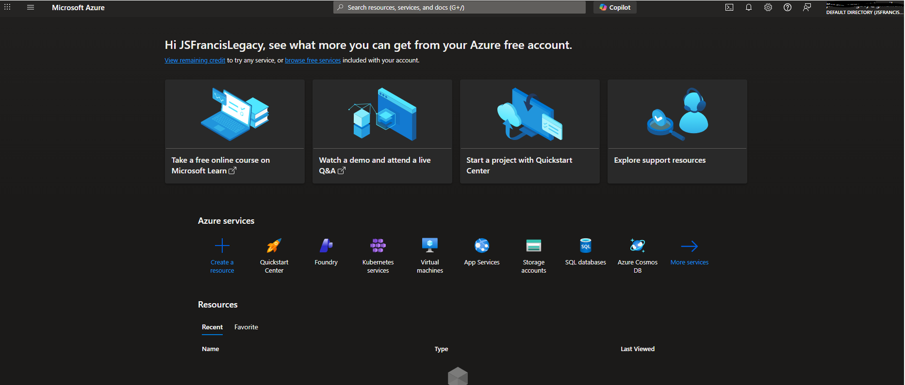
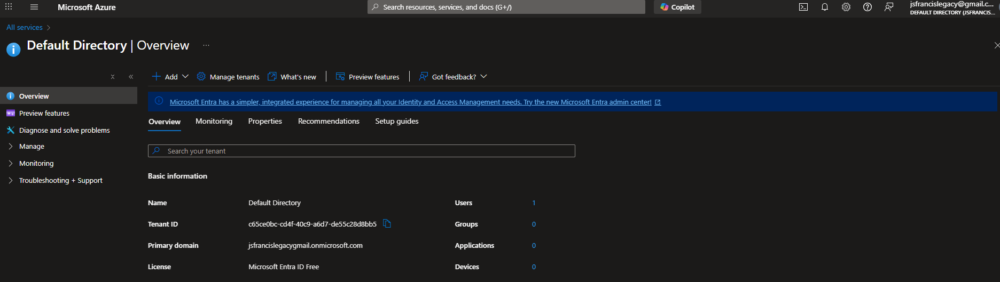
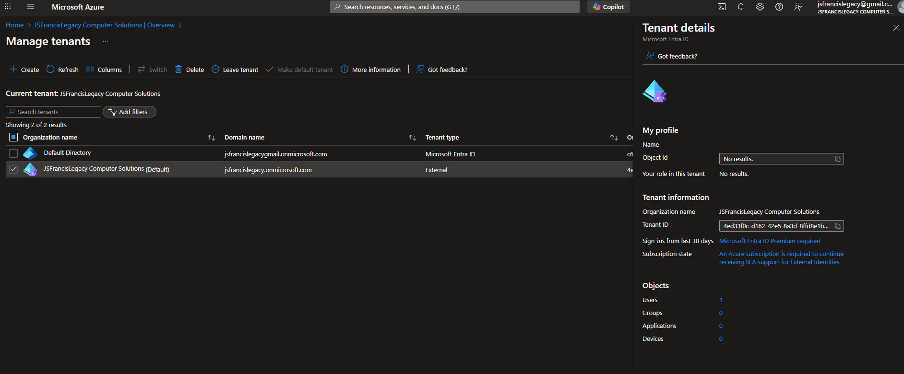
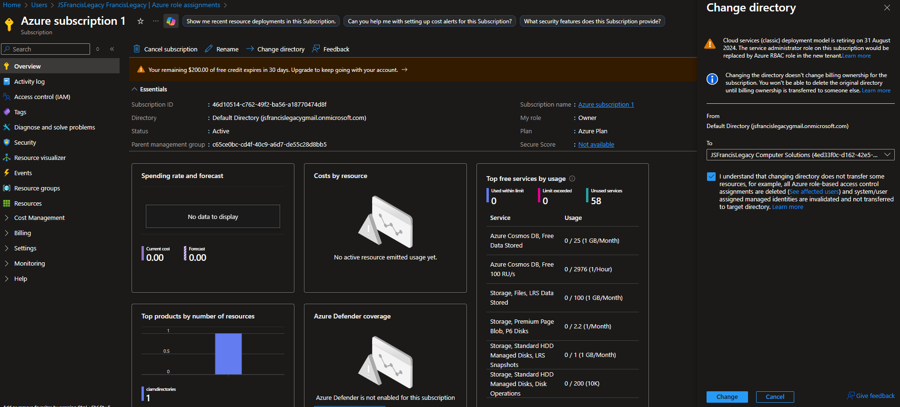
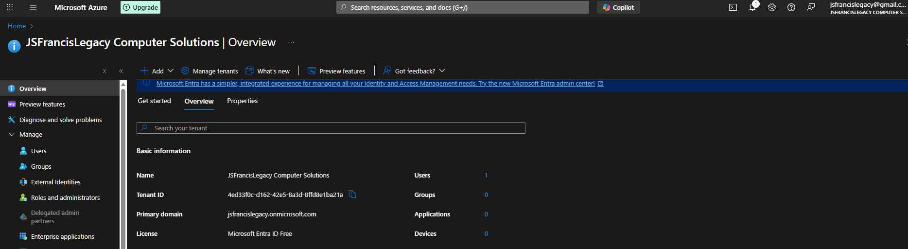
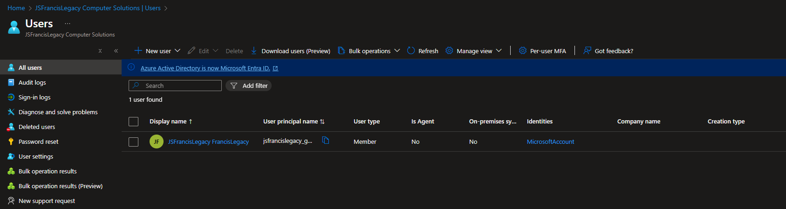

# Lab 01 — Create an Azure Tenant

This lab walks through creating a new Microsoft Azure Tenant (Microsoft Entra ID directory).  
This is the foundation for all Azure administration and security work.

---

## Objectives
By the end of this lab, you will:
- Create a new Azure tenant
- Switch to the new directory
- Understand the difference between Azure subscriptions and Entra ID tenants

---

## Prerequisites
- A personal Microsoft account (example: outlook.com)
- Access to https://portal.azure.com
- Azure subscription created (Free Tier works)

---

## Step 1 — Sign in to the Azure Portal
1. Go to https://portal.azure.com  
2. Sign in using your personal Microsoft account  
3. Confirm you are on the Azure home screen

**Screenshot:** Azure Portal home page  

---

## Step 2 — Open Microsoft Entra ID
1. In the left menu, select **Microsoft Entra ID**  
2. This shows your current default directory

**Screenshot:** Entra ID overview of your default directory  

---

## Step 3 — Create a New Tenant
1. At the top of Entra ID, select **Manage tenants**  
2. Click **Create**  
3. Choose **Microsoft Entra ID** as the tenant type  
4. Fill out the fields:
   - **Organization name:** `JSFrancisLegacy Computer Solutions`
   - **Initial domain name:** `jsfrancislegacy.onmicrosoft.com`
   - **Country/Region:** United States

5. Click **Review + Create**  
6. Click **Create**

**Screenshot:** Tenant creation page before submitting  

---

## Step 4 — Switch to Your New Tenant
1. Select your profile icon in the top-right  
2. Choose **Switch directory**  
3. Select the new tenant:  
   **JSFrancisLegacy**

**Screenshot:** Switching directories window  

---

## Step 5 — Verify Tenant Details
1. Return to **Microsoft Entra ID**  
2. Confirm the top banner now shows:
   - Directory: **JSFrancisLegacy Computer Solutions**
   - Domain: `jsfrancislegacy.onmicrosoft.com`

**Screenshot:** Entra ID overview of the new tenant  

---

## Step 6 — Confirm No Users Are Present Yet
1. In the left menu, select **Users**  
2. You should see only one user (your personal Microsoft account listed as a member)

**Screenshot:** Users page (showing only 1 member user)  

---

## Lab Completed!
You now have:
- A new Azure AD/Entra ID tenant  
- A clean environment to create real cloud admin accounts  
- A foundation for MFA, Conditional Access, and future labs

