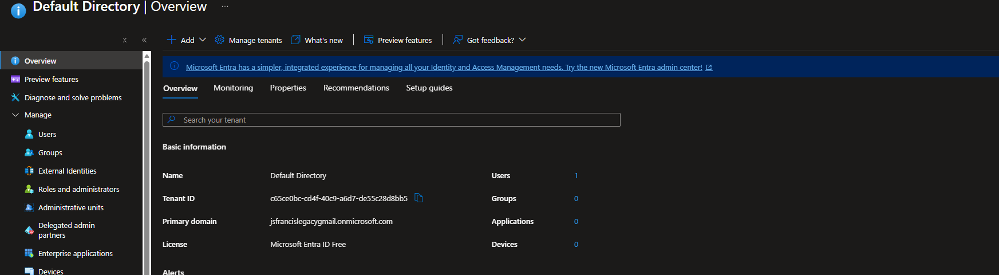
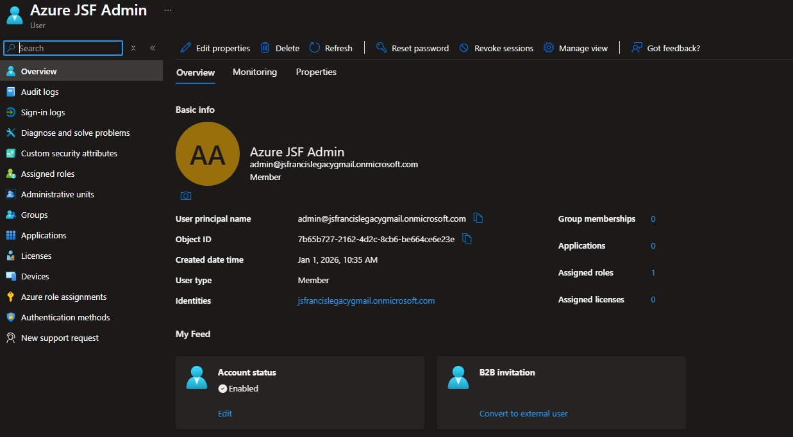
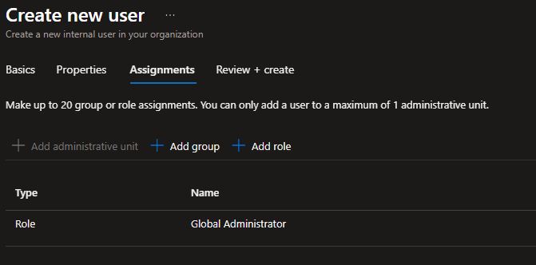
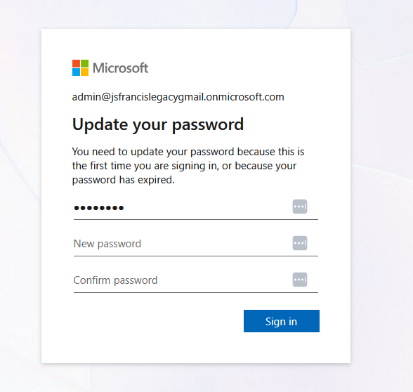
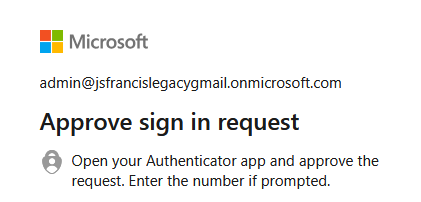
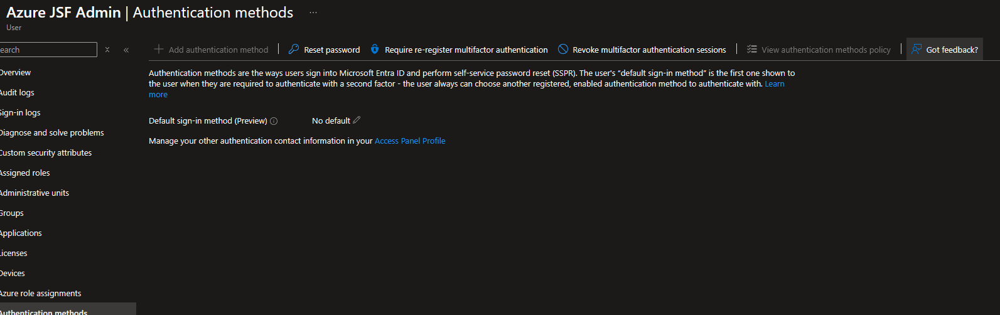

# Lab 03 — Create Admin Users and Enable MFA

This lab covers creating administrative users in Microsoft Entra ID and enforcing Multi-Factor Authentication (MFA).  
MFA is a foundational security control and is typically one of the first requirements in any enterprise Azure environment.

This lab uses the default `onmicrosoft.com` domain to avoid dependency on custom domain verification.

---

## Objectives
By the end of this lab, you will:
- Create an administrative user account
- Assign Entra ID roles
- Enable and configure MFA
- Validate MFA enforcement during sign-in

---

## Prerequisites
- Active Azure tenant
- Access to Microsoft Entra ID
- Global Administrator access
- Azure Portal access

---

## Step 1 — Open Microsoft Entra ID
1. Sign in to https://portal.azure.com  
2. Navigate to **Microsoft Entra ID**

**Screenshot:** Entra ID overview page  

---

## Step 2 — Create an Admin User
1. Select **Users**
2. Click **New user → Create new user**
3. Enter the following:
   - **User principal name:**  
     `admin@jsfrancislegacygmail.onmicrosoft.com`
   - **Name:** Azure Admin
   - **Password:** Auto-generate
   - **Require password change at next sign-in:** Yes

4. Click **Create**

**Screenshot:** New user creation screen  

---

## Step 3 — Assign Global Administrator Role
1. Open the newly created user
2. Select **Assigned roles**
3. Click **Add assignments**
4. Choose **Global Administrator**
5. Click **Add**

**Screenshot:** Role assignment page  

**Security Note:**  
In production environments, Global Administrator access should be tightly restricted.

---

## Step 4 — Sign In as the New Admin User
1. Open a private/incognito browser window
2. Go to https://portal.azure.com
3. Sign in as: admin@jsfrancislegacy.onmicrosoft.com
4. Change the temporary password when prompted

**Screenshot:** First-time password reset screen  

---

## Step 5 — Register Microsoft Authenticator for MFA
During the first sign-in, the user is prompted to configure security information.

1. Select **Microsoft Authenticator app** as the authentication method
2. Complete the registration process using the Authenticator mobile app
3. Approve the test notification to finalize setup

**Screenshot:** MFA approval request in Microsoft Authenticator  

---

## Step 6 — Confirm MFA Configuration

1. Return to **Microsoft Entra ID**
2. Navigate to **Users**
3. Open the administrative user account
4. Select **Authentication methods**

This view confirms that authentication methods are managed for the user and that MFA registration has been completed.

**Screenshot:** Authentication methods overview for admin user  

---
## Lab Completed
You now have:
- A dedicated administrative account
- Multi-Factor Authentication registered and enforced
- Verified authentication methods for privileged access

This establishes a secure baseline for implementing Conditional Access policies.

