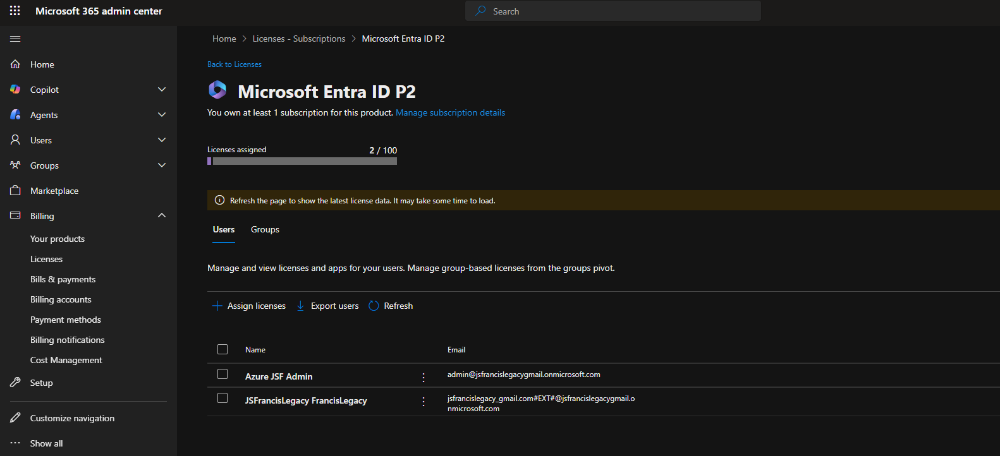
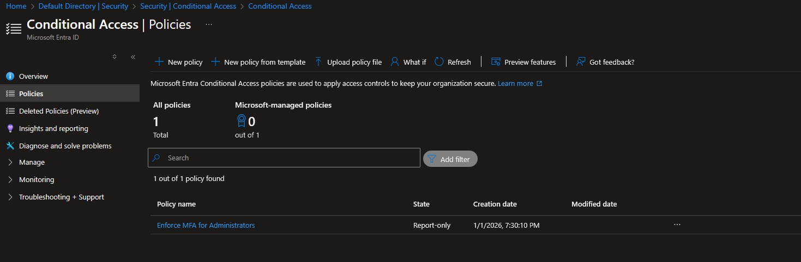
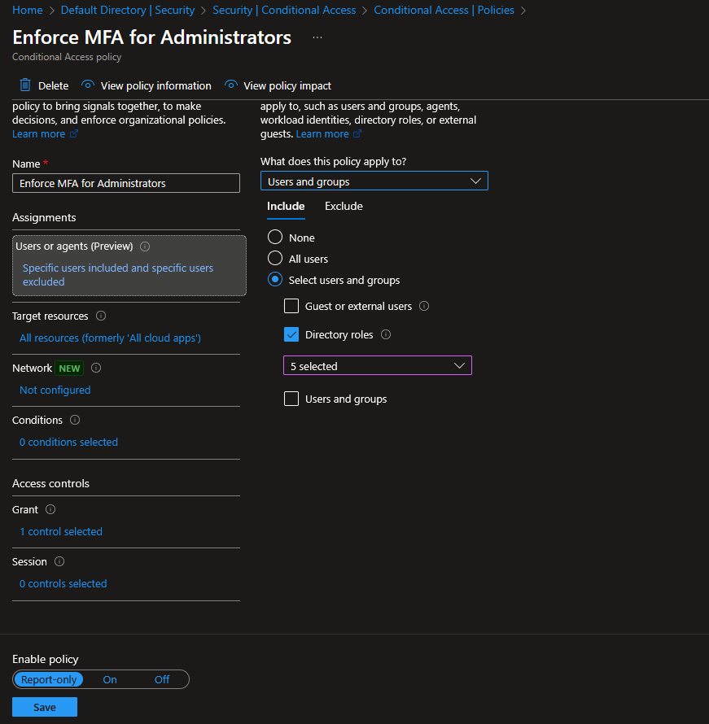
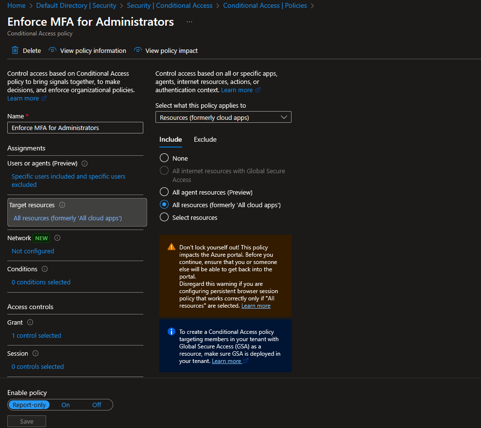
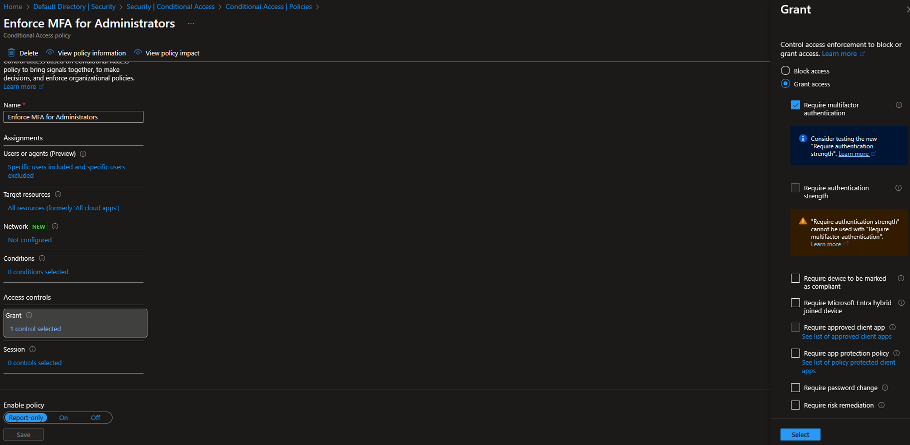
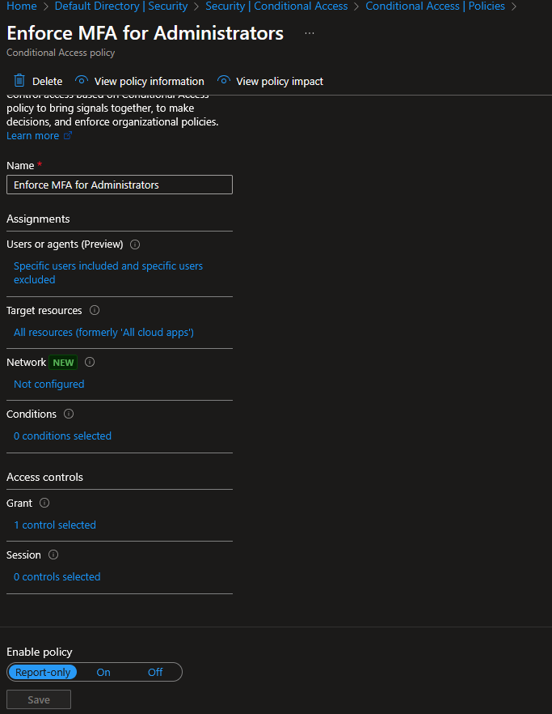

# Lab 04 — Conditional Access Baseline

This lab documents the implementation of a baseline Conditional Access policy in Microsoft Entra ID to protect privileged access.

Conditional Access allows administrators to enforce security controls—such as MFA—based on role, application, and sign-in context. This is a core control used to reduce the risk of compromised administrative accounts.

> **Licensing Note:**  
> Conditional Access requires Microsoft Entra ID P1 or P2 licensing.  
> This lab was completed using a **Microsoft Entra ID P2 trial**, which is functionally equivalent to licensed client environments.

---

## 🎯 Objectives
By the end of this lab, you will:
- Create a Conditional Access policy targeting administrative roles
- Enforce MFA through policy (not just per-user setup)
- Understand role-based scoping for security controls
- Validate that the policy is active and enforcing access requirements

---

## 🛠️ Prerequisites
- Azure tenant with Microsoft Entra ID
- Administrative account with MFA registered
- Microsoft Entra ID P1 or P2 licensing (trial or paid)

---

## 🧵 Step 1 — Open Conditional Access
1. Sign in to https://portal.azure.com
2. Navigate to **Microsoft Entra ID**
3. Select **Security**
4. Under **Protect**, select **Conditional Access**

📸 **Screenshot:** Conditional Access overview page  
_Save screenshot in:_  
`/screenshots/lab04/conditional-access-overview.png`

---

## 🧵 Step 2 — Create a New Policy
1. Select **Policies**
2. Click **Create new policy**
3. Enter a policy name: Enforce MFA for Administrators

📸 **Screenshot:** New Conditional Access policy creation  
_Save screenshot in:_  
`/screenshots/lab04/create-policy.png`

---

## 🧵 Step 3 — Assign Users and Roles
1. Under **Assignments**, select **Users**
2. Choose **Directory roles**
3. Select **Global Administrator**
4. (Optional) Add other privileged roles as required

**Why roles:**  
Targeting roles ensures the policy automatically applies to future administrators without manual updates.

📸 **Screenshot:** Role-based user assignment  
_Save screenshot in:_  
`/screenshots/lab04/assign-admin-role.png`

---

## 🧵 Step 4 — Configure Target Resources
1. Under **Assignments**, select **Target resources**
2. Choose **All resources**  
   *(formerly labeled "All cloud apps")*

This ensures administrative access is protected across all Azure and Entra ID resources.

📸 **Screenshot:** Target resources set to All resources  
_Save screenshot in:_  
`/screenshots/lab04/cloud-apps.png`

---

## 🧵 Step 5 — Configure Grant Controls
1. Under **Access controls**, select **Grant**
2. Choose **Grant access**
3. Enable **Require multi-factor authentication**
4. Click **Select**

📸 **Screenshot:** MFA grant control configuration  
_Save screenshot in:_  
`/screenshots/lab04/grant-mfa.png`

---

## 🧵 Step 6 — Enable the Policy in Report-only Mode

The policy was enabled in **Report-only** mode to validate scope, targeting, and impact before enforcement.
This approach aligns with Microsoft best practices for safely rolling out Conditional Access policies, especially in new or client environments.

📸 **Screenshot:** Conditional Access policy enabled in Report-only mode  
_Save screenshot in:_  
`/screenshots/lab04/policy-report-only.png`

---

## 🎉 Lab Completed
You now have:
- A Conditional Access policy targeting privileged directory roles
- MFA requirements evaluated through Conditional Access
- A validated baseline policy configured in **Report-only** mode

This policy is intentionally left in Report-only to confirm scope and behavior prior to enforcement and can be switched to **On** once validation is complete in a client environment.

